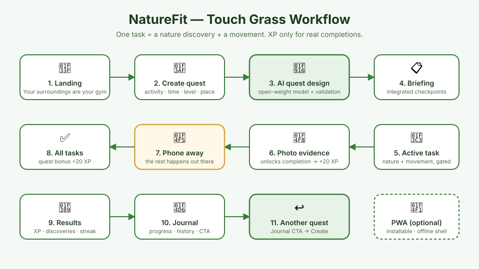

# NatureFit 🌿

**Your surroundings are your gym.**

NatureFit is an outdoor adventure game for the DEV Community Hacktoberfest 2026
Open-Source AI Challenge (Week 1 — "Touch Grass"). Instead of a workout list,
NatureFit generates outdoor quests where **every task is one nature discovery +
one movement**: find a tree → photograph it → do squats beside it.

The screen gives you a mission. The real activity happens outside.

## 📸 The NatureFit Workflow



| # | Screen | What happens |
|---|--------|--------------|
| 1 | [Landing](docs/screenshots/01-landing.png) | Your surroundings are your gym |
| 2 | [Create quest](docs/screenshots/02-create-quest.png) | Pick activity, time, level, environment |
| 3 | [Quest briefing](docs/screenshots/03-quest-briefing.png) | Integrated nature×movement checkpoints |
| 4 | [Active task](docs/screenshots/04-active-task.png) | Nature action + movement, evidence-gated |
| 5 | [Photo evidence](docs/screenshots/05-photo-evidence.png) | Photo unlocks task completion |
| 6 | [Task complete](docs/screenshots/06-task-complete.png) | +20 Outdoor XP, honest self-reporting |
| 7 | [Phone away](docs/screenshots/07-phone-away.png) | Screen-minimal mode, timer runs |
| 8 | [All done](docs/screenshots/07b-all-done.png) → [Results](docs/screenshots/08-results.png) | Quest bonus, discoveries tally |
| 9 | [Journal](docs/screenshots/09-journal.png) | Outdoor XP, streak, history, CTA |
| 10 | [Install prompt](docs/screenshots/10-install-prompt.png) | Optional PWA install |

```text
Landing → Create → AI/fallback Quest → Active task (nature + movement)
   → Photo evidence → +20 XP → Phone-away mode → All tasks → Results
   → Journal → Start another quest
```


## Core concept

> **Could this app still make sense if you removed either the nature part or the fitness part? No.**
> Every task couples a nature action with a movement action. They are inseparable.

Example quest — Tree Circuit:

```
01  Find your first tree
    📷 Photograph the whole tree
    🏃 Then: 10 squats beside it                    +20 Outdoor XP

02  Reach a different tree
    📷 Photograph its bark up close
    🏃 Then: 10 lunges                              +20 Outdoor XP

03  Find a fallen leaf beneath a tree
    📷 Photograph it where it lies
    🏃 Then: 90 sec brisk walk                      +20 Outdoor XP
```

## Architecture

```
React 19 + Vite 8 (no backend)
      │
      ├── Landing → Create quest → Quest briefing
      ├── Active quest: one task at a time, phone-away mode
      ├── Evidence: photo (compressed to data URL) or declared movement
      ├── Outdoor XP — awarded only on real task completion
      └── LocalStorage: quest in progress, history, discoveries, streak
             │
             ▼
      AI Quest Generator (open-weight, configurable)
             │
             ▼
      Fallback quest library (works fully offline)
```

## Data model

```js
{
  id: 'quest-1697…',
  title: 'Tree Circuit',
  icon: '🌳', theme: 'tree',
  description: 'Your next workout is hiding in the trees around you.',
  duration: 30, fitnessLevel: 'Beginner', activity: 'Walking', environment: 'Park',
  source: 'offline' | 'ai',
  timer: { startTs, pausedTotal, paused, pauseTs },
  tasks: [
    {
      id: 'task-1-…',
      title: 'Find your first tree',
      natureAction: 'Photograph the whole tree',   // the nature half
      fitnessAction: '10 squats beside it',        // the movement half
      evidence: 'photo' | 'self',
      natureType: 'tree' | 'leaf' | 'flower' | 'bird' | 'other',
      xp: 20,
      hint: '…',
      completed: false, completedAt: null, photoData: null
    }
  ]
}
```

## Outdoor XP rules (anti-farming)

- **One XP system**: Outdoor XP. There is no Fitness XP / Nature XP.
- XP is awarded in exactly **one** code path: when a task flips
  `completed: false → true` (photo evidence present + movement confirmed).
- Generating, opening, starting, refreshing, navigating: **0 XP**.
- A task can never award XP twice — the `completed` flag is the guard.
- Completing **all** tasks adds a one-time **+20 quest bonus**.
- Quests can only be archived ("completed") when every task is done.
  You cannot submit an empty completion.
- **Streak rule**: today's streak is only touched when at least one task is
  genuinely completed. Opening or generating quests never affects it.
- Old prototype storage keys (`naturefit_xp`, etc.) are wiped on first run
  so no broken XP carries over.

## Evidence rules (honest by design)

- **Photo tasks**: the Complete button stays disabled until a photo exists.
  Photos are downscaled to ~420px JPEG data URLs and stored on the task itself.
  No object URLs, no cross-task credit, no fake "AI verified" claims.
- **Movement tasks**: self-reported, labeled as such. Timed movements
  (e.g. "60 sec brisk walk") offer an optional countdown; you can skip
  the timer with "I already did it".
- **Observation-only tasks** (listening): no photo required.
- Nothing is ever claimed to be AI-verified. The AI designs quests; it does
  not grade photos.

## AI integration (open-weight)

The quest generator is called only through env vars (`.env.local`):

```env
VITE_AI_API_URL=https://openrouter.ai/api/v1/chat/completions
VITE_AI_API_KEY=your_key
VITE_AI_MODEL=google/gemma-2-9b-it:free
```

Any OpenAI-compatible endpoint works (OpenRouter, Ollama `http://localhost:11434/v1/chat/completions`, etc.).

The system prompt asks the open-weight model to design **integrated**
nature × movement tasks as strict JSON, with hard safety rules (no picking
living plants, no disturbing wildlife, only fallen objects, photography and
observation). Recent quest titles are passed so the model avoids repetition.

Without a key (or on any API failure) the app falls back to four curated
offline quest templates — Tree Circuit, Leaf Hunt, Park Explorer, Bird Walk —
parameterized by fitness level and activity. The badge on the quest card shows
whether the quest was AI-designed or offline.

## Safety

Never generated or templated: picking living leaves, breaking branches,
damaging plants, touching/capturing wildlife, disturbing nests, littering,
restricted areas. Fallback quests only use observation, photography,
listening and fallen natural objects.

## Run it

```bash
cd naturefit
npm install
npm run dev        # http://localhost:5173
npm run build      # production build
```

## Testing performed

- New user (cleared storage): Outdoor XP 0, streak 0, no fake history.
- Generate + start quest: still 0 XP.
- Task completion gated on evidence: photo task cannot complete without a photo.
- Completing a task: +XP once; re-opening does not re-award.
- Refresh mid-quest: task completion, XP and timer survive (LocalStorage).
- Quest can only be finished when all tasks are complete (no empty submissions).
- Quest bonus added exactly once.
- Second quest: previous XP persists, new quest starts at 0 earned.
- Journal shows only real history; empty states before first quest.
- Mobile viewport (375px), keyboard focus states, aria labels, reduced motion.

## Limitations / future work

- No GPS/step tracking — distance is never fabricated, so it isn't shown.
- Photo verification is presence-only (by design for MVP).
- Optional future: AI photo descriptions, weather awareness, PWA install.

---

## 📱 PWA Support

NatureFit is a **browser-first progressive web app** — it works as a normal website in any modern browser, and can be installed as an app when the browser supports installation.

### Browser (no installation required)
Opens at any deployed URL — Android/iOS phones, Windows/macOS/Linux laptops, Chrome/Edge/Safari/Firefox.

### Installed PWA (optional)
- `display: "standalone"` — opens from the home screen/app launcher like a native app
- Install banner appears once (dismissal stored locally); "Install app" from the browser menu always works
- **Never required**: the website itself is the primary product

### Offline behavior (honest by design)
- The service worker (Workbox via `vite-plugin-pwa`) precaches the app shell — HTML, CSS, JS, icons
- Once loaded, NatureFit still opens without internet
- Offline quests come from the **local fallback library** — the UI labels them "Offline quest", never "AI-generated"
- When online with a configured AI endpoint, AI quest generation works exactly as before
- An unobtrusive banner shows offline status: *"Offline — AI quests unavailable. Ready-made quests are available."*

### Update handling
New versions wait patiently: *"A new version of NatureFit is available. Refresh when you're ready."* — never a forced refresh mid-quest. Active quest state survives updates.

### Data storage
LocalStorage on the device — progress does **not** sync between devices (by design for this MVP). No accounts, no database.

